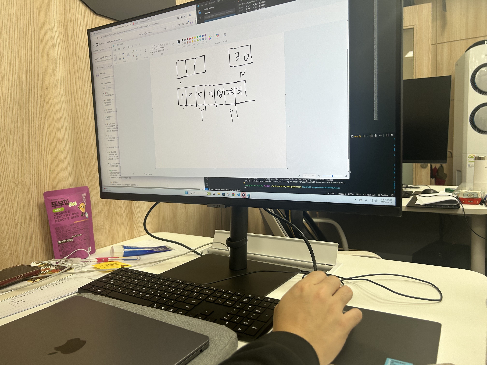

# import sys
백준을 풀 때는 그냥 기본적으로 ```import sys```를 써야겠다... 
swea에서는 못쓰긴하는데 이게 **런타임**에 아주 큰 영향을 미치는 것 같다! 

```
import sys
input = sys.stdin.readline
```

그리고 sys를 쓰면 
```
for ai in arr:
    aj = x- ai
    if aj in arr:
        count += 1
        # arr.remove(aj)

print(int(count/2))
``` 
이런식으로 안빼도 된다 
(근데 애초에 빼는게 불가능하다- 에러뜸) (input에선 가능한데 sys에서는 불가능)
> for ai in arr:
RuntimeError: Set changed size during iteration

# 투 포인터
* 배열을 얼마나 빨리 탐색할 수 있냐


풀이를 검색하다보니 **투 포인터**라는게 자주 언급됐다. 
이게 머야... 나는 처음봐...
공부 ㄱ

두 가지의 포인터를 사용해서 문자열이나 배열에서 원하는 값을 찾거나 반복문을 써야할 때 쓰기 좋은 방식. **그냥 기본방식인 탐색(반복문)을 쓰다 보면 시간이 오래 걸리거나 시간 초과가 걸리는 경우에, 투포인터를 사용하면 메모리와 시간효율성을 높일 수 있다.**

(1) 양끝에서 시작 (투포인터)

(2) 같은 곳에서 시작 (슬라이딩 윈도우)

.

.

참고 링크https://learning-e.tistory.com/37